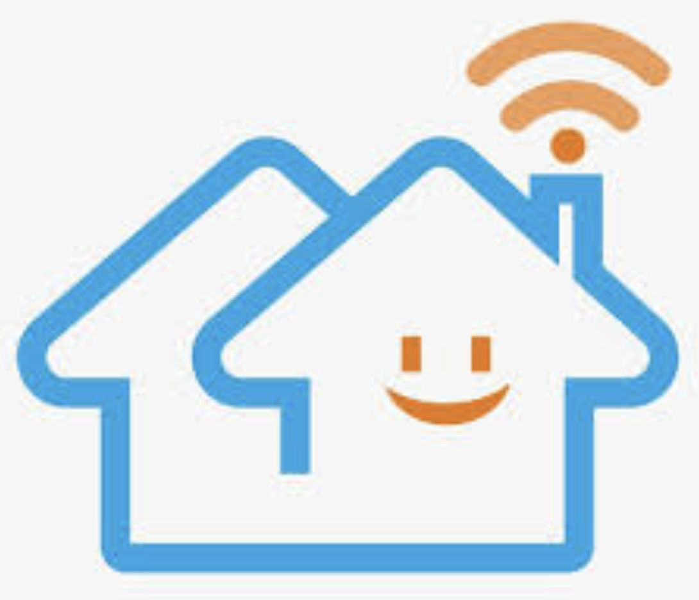
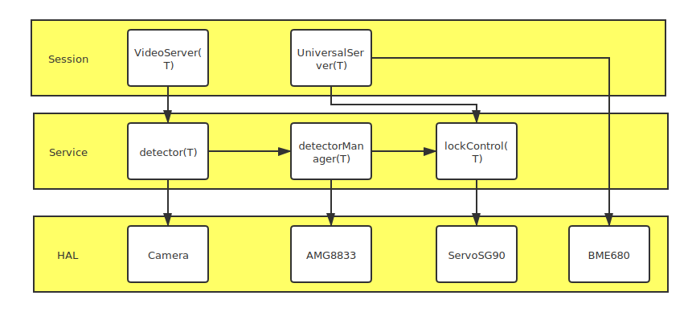

<p align="center"></p>

<h1 align="center">

  [Guardian] the Smart-Home-System
  <br>
  <a href="https://github.com/WayenVan/SmartHomeSystem/issues"></a>
  <a href="https://img.shields.io/github/languages/code-size/WayenVan/SmartHomeSystem"></a>
  <a href="https://www.gnu.org/licenses/gpl-3.0.en.html"></a>
  <br>
    <a href="https://www.youtube.com/watch?v=8SevkU7DxNo"></img></a>
  <a href="https://www.instagram.com/smart_home_system123/"></img></a>
  <a href="https://twitter.com/SmartHomeSyste4"></img></a>
<!--Icons made by https://www.freepik.com Freepik from "https://www.flaticon.com/-->
</h1> 


 ## Overview

The Smart-Home-System is an open source project for multi-functional home monitoring system. It works mainly works as an server with other environment sensors . Users can do either remote monitoring, wireless control and automatic door control in maximums 24 clients(android and java desktop as examples inside the project) simultaneously.

## Project structure

`Android` is the Android application client

`DesktopClinet` is a simple Java desktop client example based on Swing

`PrototypeTest` is some prototype when we try some new ideas

`Application` is the main logic server running on Raspberry PI (T means self contained thread):



## Features

### Basic

- Indoor gas status monitoring
- Remote video monitoring with face detection
- Remote door control
- Automatic door control by face detection and temperature measurement

### Advanced

thanks to the independent structure of the server users can get information of server by their own defined clients. One can get massages by TCP socket:

- Send 4 byte `int 0xff`  to the video server to get video frame in `int frame_size`  followed with `byte[frame_size] frame_data_incoded_with_jpeg`
- Send 4 byte `int 0x11` to the universal server to get home temperature in `int actual_temperature_in cetigrade*1000`
- Send 4 byte `int 0x12` to the universal server to get home humidity in `int actual_humidity_in_percent*1000`
- Send 4 byte `int 0x13` to the universal server to get home gas pressure in `int actual_gas_pressure_in_P*1000`
- Send 4 byte `int 0x15` to the universal server to open the door
- Send 4 byte `int 0x16` to the universal server to get door status in `int status`, if `status > 0` means door is opened, `status = 0` means door is closed.

## Installation

### Hardware

- [SG90](http://www.ee.ic.ac.uk/pcheung/teaching/DE1_EE/stores/sg90_datasheet.pdf) : Servo
- [BME680](https://www.bosch-sensortec.com/products/environmental-sensors/gas-sensors/bme680/): gas sensor
- [AMG8833](https://learn.adafruit.com/adafruit-amg8833-8x8-thermal-camera-sensor): thermal sensor
- [Raspberry Pi 3 Model B](https://www.raspberrypi.org/products/raspberry-pi-3-model-b/)
- [Camera](https://www.raspberrypi.org/documentation/hardware/camera/): image capturer

The GPIO point of Raspberry is list below, remember we are using **BCM** port number:

```shell
 +-----+-----+---------+------+---+---Pi 4B--+---+------+---------+-----+-----+
 | BCM | wPi |   Name  | Mode | V | Physical | V | Mode | Name    | wPi | BCM |
 +-----+-----+---------+------+---+----++----+---+------+---------+-----+-----+
 |     |     |    3.3v |      |   |  1 || 2  |   |      | 5v      |     |     |
 |   2 |   8 |   SDA.1 | ALT0 | 1 |  3 || 4  |   |      | 5v      |     |     |
 |   3 |   9 |   SCL.1 | ALT0 | 1 |  5 || 6  |   |      | 0v      |     |     |
 |   4 |   7 | GPIO. 7 |   IN | 1 |  7 || 8  | 1 | IN   | TxD     | 15  | 14  |
 |     |     |      0v |      |   |  9 || 10 | 1 | IN   | RxD     | 16  | 15  |
 |  17 |   0 | GPIO. 0 |  OUT | 0 | 11 || 12 | 0 | IN   | GPIO. 1 | 1   | 18  |
 |  27 |   2 | GPIO. 2 |  OUT | 0 | 13 || 14 |   |      | 0v      |     |     |
 |  22 |   3 | GPIO. 3 |   IN | 0 | 15 || 16 | 0 | IN   | GPIO. 4 | 4   | 23  |
 |     |     |    3.3v |      |   | 17 || 18 | 0 | IN   | GPIO. 5 | 5   | 24  |
 |  10 |  12 |    MOSI |   IN | 0 | 19 || 20 |   |      | 0v      |     |     |
 |   9 |  13 |    MISO |   IN | 0 | 21 || 22 | 0 | IN   | GPIO. 6 | 6   | 25  |
 |  11 |  14 |    SCLK |   IN | 0 | 23 || 24 | 1 | IN   | CE0     | 10  | 8   |
 |     |     |      0v |      |   | 25 || 26 | 1 | IN   | CE1     | 11  | 7   |
 |   0 |  30 |   SDA.0 |   IN | 1 | 27 || 28 | 1 | IN   | SCL.0   | 31  | 1   |
 |   5 |  21 | GPIO.21 |   IN | 1 | 29 || 30 |   |      | 0v      |     |     |
 |   6 |  22 | GPIO.22 |   IN | 1 | 31 || 32 | 0 | IN   | GPIO.26 | 26  | 12  |
 |  13 |  23 | GPIO.23 |   IN | 0 | 33 || 34 |   |      | 0v      |     |     |
 |  19 |  24 | GPIO.24 |   IN | 0 | 35 || 36 | 0 | IN   | GPIO.27 | 27  | 16  |
 |  26 |  25 | GPIO.25 |   IN | 0 | 37 || 38 | 0 | IN   | GPIO.28 | 28  | 20  |
 |     |     |      0v |      |   | 39 || 40 | 0 | IN   | GPIO.29 | 29  | 21  |
 +-----+-----+---------+------+---+----++----+---+------+---------+-----+-----+
 | BCM | wPi |   Name  | Mode | V | Physical | V | Mode | Name    | wPi | BCM |
 +-----+-----+---------+------+---+---Pi 4B--+---+------+---------+-----+-----+
```

Here we use power of 5v, and v- as 0V.

The BME680 and AMG8833 is connected in series I2C with any SDA and SCL pin.

The servo can be connected to any GPIO port.

### Software

Firstly install `CMake`,  the minimum make version is 3.12.4

Then, download and install all `CPP` libraries listed below:

- [pigpio](http://abyz.me.uk/rpi/pigpio/download.html)
- [opencv4.x](https://docs.opencv.org/master/d0/db2/tutorial_macos_install.html)
- [boost](https://www.boost.org)

**important: please using `make install` to install all libraries and include headers to your `/usr/lib` and `/usr/include` directory, if you want to specify your own library and headers' directory, please modify the `Application/CmakeLists.txt` file.**

Then, make sure you've  installed python3.7, here we recommend [anaconda](https://www.anaconda.com)

Then, install python packages as **root** by typing:

```shell
sudo pip3 install adafruit_amg88xx
sudo pip3 install bme680
```

Then, you need check the connectivity of hardware, find the i2c address of bme680 and amg8833, in raspberry pi, you may check it by typing:

```shell
sudo i2cdetect -y 1
```

change the settings in `Application/main_def.hpp`:

```c++
#define LOCKER_SERVO_PIN 17   //lock servo port
#define VIDEO_SERVER_PORT 12345 //video server port
#define UNIVERSAL_SERVER_PORT 1148 // universal server port
#define AMG8833_ADDR 0x69 //amg8833 i2c address
#define BME680_ADDR 0x77 //bme680 i2c address
```

now you can start your build:

```shell
cd Application/build
cmake ..
make
```

if succeed, you can execute the application by

```shell
sudo ./VideoStream
```

all unit tests can be run in `Application/build/tests/` folder.

## Contributors

[Liangyue Yu 2522553y](https://github.com/Liangyue-1998)

[Jingyan Wang 2533494w](https://github.com/WayenVan)

[Tao Lin 2528179l](https://github.com/brlink)

